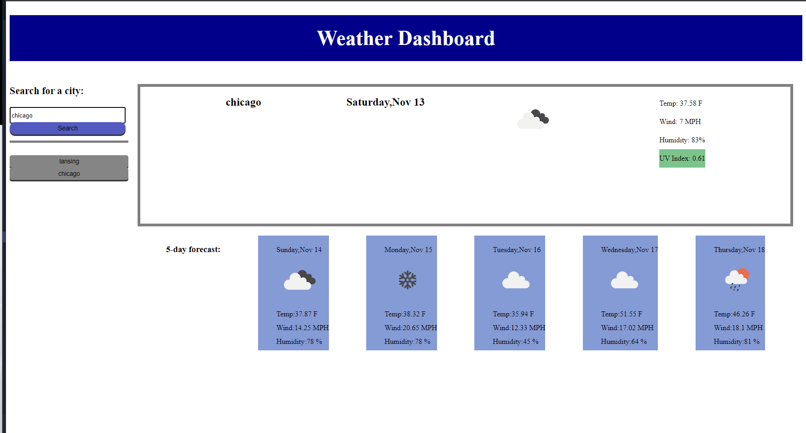

# Weather Dashboard
## This is a weather outlook for multiple cities
* this page will check weather outlook for cities 
* a trip maybe planned accordingly 
## current conditions
* a user will be able to search for a city 
* the page will show current weather conditions for the city 
* the page will show the future conditions for the city 
## Presentation
* when a user views the current weather conditions, that city will be shown
* the city show includes name, date, icon, representing conditions such as temperature, humidity, wind speed and UV index
## UV index
* the uv index is presented with a color 
* the color represents whether the condition is favorable
## Future conditions
* when a user views the future conditions for a city, a 5-day forecast is displayed
* the displays include date, icon, temperature, wind speed, and humidity
## Search history
* a city search will be saved in local storage 
* the search will be displayed in search history
* when click will show that city again / in progress
## Link to my website  https://ening6649.github.io/weatherdashboard/
## screenshot  